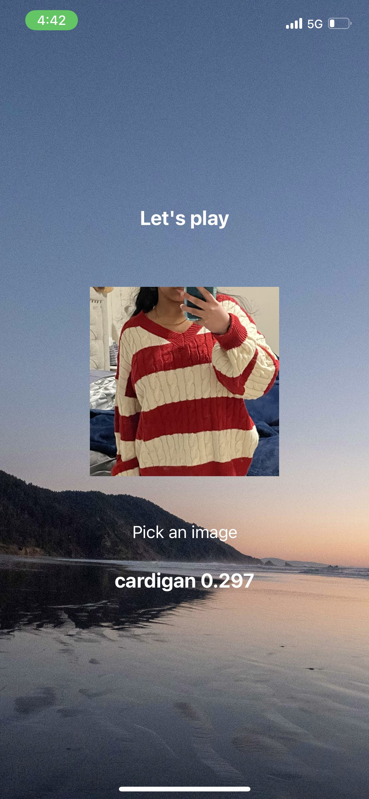
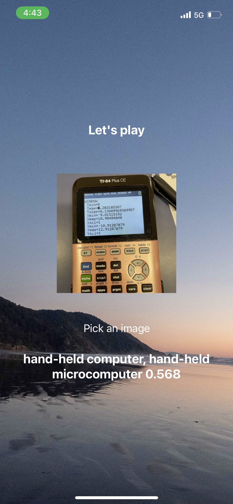
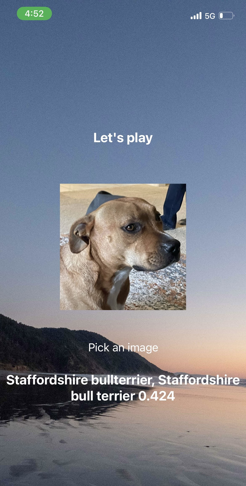

# Object identification sample react-native project

## How to start this project

Run following command first in Terminal

```
yarn install
```

And then run following to start npx to test

```
npx expo start
```

## Some sample pages are

1. First image with a 29.7% confidence prediction



2. Second image with a 56.8% confidence prediction



3. Third image with a 42.4% confidence prediction

